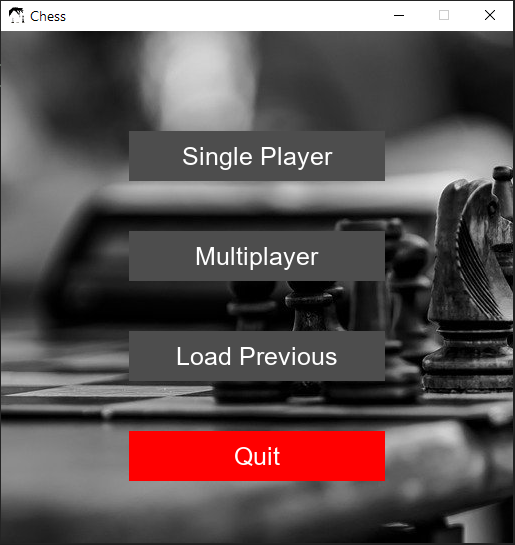
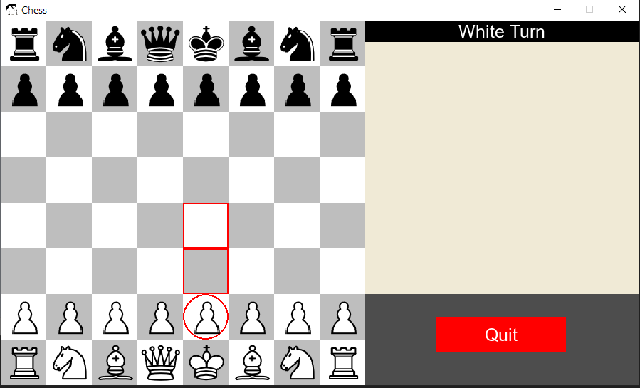
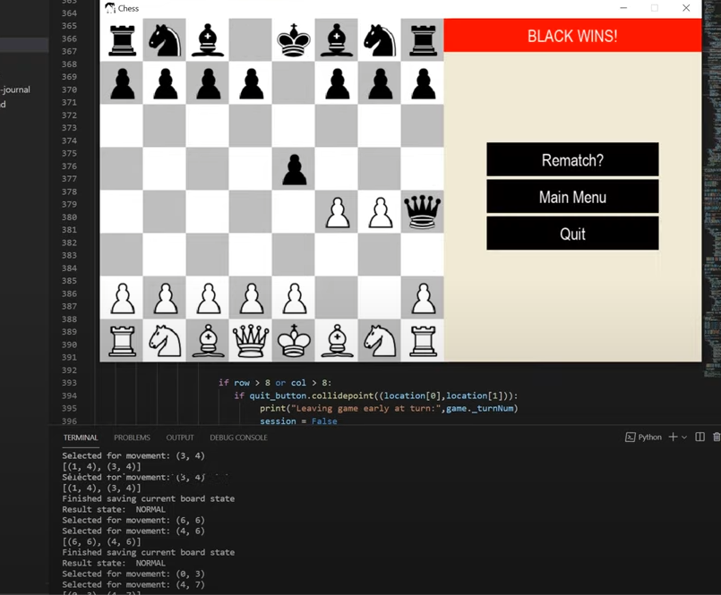
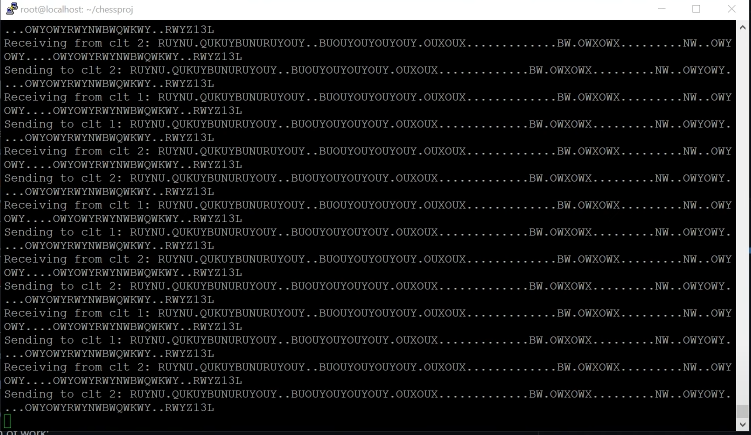

#  PythonChess

PythonChess is a chess game written in Python using the Pygame library. It is a school project for the course COP4521: Secure, Parallel, and Distributed Programming in Python at Florida State University during the Fall of 2021. The game is capable of being played alone against an AI, against another player on the same machine, or against another player on a separate machine. It is also capable of loading the last saved game from the database.

<iframe width="560" height="315" src="https://www.youtube.com/embed/WhFTBNQayJo" title="YouTube video player" frameborder="0" allow="accelerometer; autoplay; clipboard-write; encrypted-media; gyroscope; picture-in-picture" allowfullscreen></iframe>

  

    

        
        
Image of the main menu

    

  

  

    

        
        
Image of the beginning of a match

    

  

  

    

        
        
Image of a victors screen after player forfeited

    

  

  

    

        
        
Image of a victors screen after player forfeited 

    

  

 

### REQUIREMENTS

At least Python 3.8.0

### RUNNING

If on Windows: Install Python through the Windows Store and then run the .bat file.
PYGAME is automatically installed through the .bat file.
This is recommended even if you use WSL.

If you're using WSL and don't want to run a .bat file, make sure you have a XServer
running on your machine for LINUX graphical applications.

If on LINUX:
Run the command: pip install PYGAME
Only run it if you don't already have PYGAME installed on your LINUX machine.
Otherwise just run the game.py script through python.

OR:
Download and install from the latest release.

### RUNNING THE SERVER

Run the python script on another computer or a dedicated server. Make sure to modify the client.py script
to account for the IP address of the machine. The server is only capable of having two players on it
at a time.

### PROBLEM

To develop a playable chess game without any game specific libraries through Python with several features. The features that were sought to be accomplished are listed below.

* Enable saving/loading of matches
* Ability to play against another person (on same or separate terminals)
* A clean and effective GUI system for visual representation of gameplay

### INSTRUCTIONS FOR USER INTERFACE (OUTSIDE THE OBVIOUS)

* Castling can only be initiated by the King.

### LIST OF PYTHON LIBRARIES USED

* pygame - for handling the graphical portions of the game
* sqlite3 - for the database
* datetime, time, sys, random, typing, copy, math, itertools, enum, socket, multiprocessing

### SEPARATION OF WORK

The separation of work largely became highly mixed during the development of this project, below is the original separation of work from our project proposal submission:

* [Jose Ramirez](https://github.com/joantram): Developing the chess game in Python to make it work, either with the use of the python-chess library if permitted or completely from scratch.  Will also help with developing elsewhere for the chess game as needed.

* [Tyler Pease](https://github.com/SirTarragon): Developing the General User Interface for the game itself – interfacing with the board to allow for better visibility, with potential move highlighting for visibility as well as helping with developing the chess game.

* [Tyler McLanahan](https://github.com/tylermclanahan): Developing the saving and loading mechanics for the database – hopefully to save every move made by both black and white and to be able to load back to that state as well as helping with developing the chess game.

* [Brandon Smith](https://github.com/brandonsmith-prgrms): Developing the capability of being able to easily revert moves by the player into a stack like Python-Chess as it may prove useful if able to be saved and for bug testing. Will do preliminary research into what we need for WebSockets to allow for two-player separate device playability, and will help with developing the chess game.